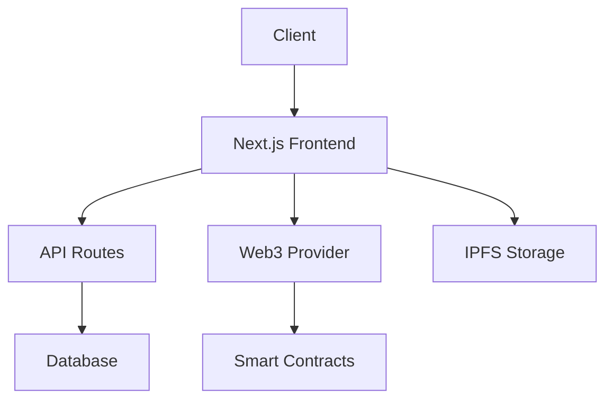
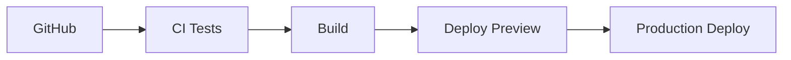

# Architecture

This document outlines the technical architecture of Frax Social, explaining how different components work together to create a seamless user experience.

## Technology Stack

### Frontend
- **Framework**: Next.js 13+ with App Router
- **Styling**: Tailwind CSS
- **State Management**: React Hooks + Context
- **Web3 Integration**: ethers.js
- **UI Components**: Custom components with dark/light mode

### Backend
- **API Routes**: Next.js API routes
- **Database**: PostgreSQL (planned)
- **Caching**: Redis (planned)
- **Authentication**: Web3 + JWT

### Infrastructure
- **Hosting**: Vercel
- **CDN**: Vercel Edge Network
- **Storage**: IPFS (for decentralized content)
- **Analytics**: Self-hosted analytics (planned)

## System Architecture



## Component Structure

```
src/
├── app/                    # Next.js 13 App Router
│   ├── governance/        # Governance pages
│   ├── learn/            # Learning platform
│   └── layout.tsx        # Root layout
├── components/
│   ├── ui/               # Reusable UI components
│   └── web3/             # Web3 integration components
├── hooks/                # Custom React hooks
├── lib/                  # Utility functions
└── translations/         # i18n content
```

## Key Components

### Governance Dashboard
```typescript
// Enhanced governance system
interface GovernanceDashboard {
  proposals: Proposal[]
  delegates: Delegate[]
  metrics: CommunityMetrics
  discussions: Discussion[]
}

// Proposal management
interface Proposal {
  id: string
  title: string
  description: string
  status: ProposalStatus
  votes: Vote[]
}
```

### Learning Platform
```typescript
// Multi-language course system
interface Course {
  id: string
  modules: Module[]
  translations: Record<string, CourseTranslation>
  progress: Progress
}

// Progress tracking
interface Progress {
  completed: boolean
  moduleProgress: Record<string, ModuleProgress>
  lastAccessed: Date
}
```

## Data Flow

1. **User Interaction**
   ```mermaid
   sequenceDiagram
       User->>Frontend: Interact with UI
       Frontend->>API: Make request
       API->>Database: Query data
       Database->>API: Return results
       API->>Frontend: Send response
       Frontend->>User: Update UI
   ```

2. **Web3 Integration**
   ```mermaid
   sequenceDiagram
       User->>Wallet: Sign transaction
       Wallet->>Smart Contract: Submit transaction
       Smart Contract->>Frontend: Event emission
       Frontend->>User: Update UI state
   ```

## Performance Optimizations

### Frontend
- Static page generation
- Dynamic imports
- Image optimization
- Code splitting

### Backend
- API route caching
- Database indexing
- Connection pooling
- Rate limiting

## Security Measures

1. **Authentication**
   - Web3 wallet signatures
   - JWT session management
   - Rate limiting

2. **Smart Contract Security**
   - Multi-sig requirements
   - Timelock mechanisms
   - Emergency pause functionality

3. **Data Protection**
   - Input validation
   - XSS prevention
   - CORS policies
   - Content Security Policy

## Monitoring

### Metrics
- Page load times
- Transaction success rates
- API response times
- Error rates

### Alerts
- Smart contract events
- System errors
- Performance degradation
- Security incidents

## Deployment

### CI/CD Pipeline


### Environment Setup
- Development
- Staging
- Production

## Future Considerations

1. **Scalability**
   - Horizontal scaling
   - Microservices architecture
   - GraphQL implementation

2. **Features**
   - Mobile app
   - Push notifications
   - Social features
   - Analytics dashboard

3. **Infrastructure**
   - Multi-region deployment
   - Enhanced caching
   - Backup solutions
